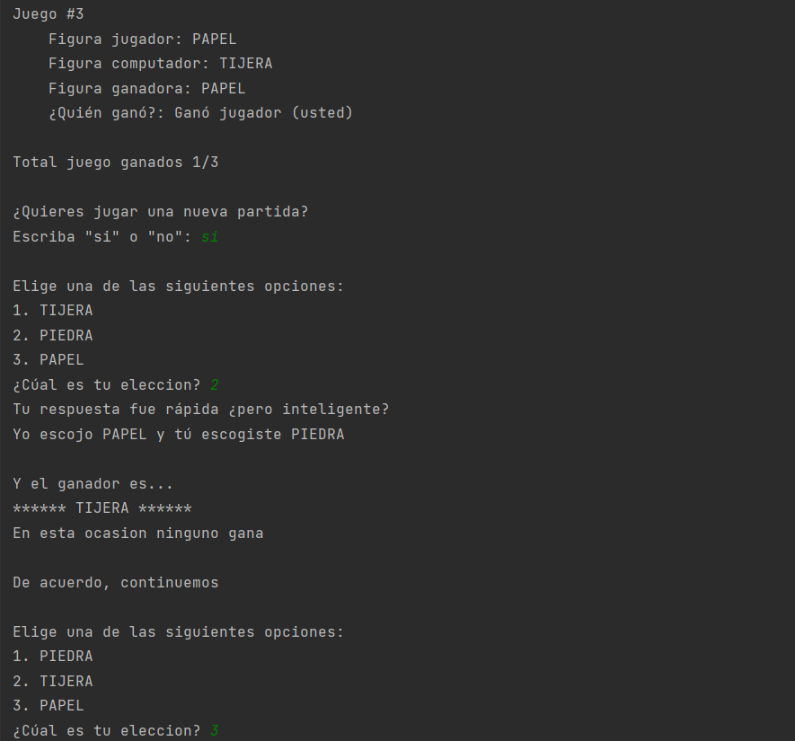

# Rock, paper or scissors

This application is a game of figures, you choose which figure you want to launch (rock, paper or scissors).

## Preview





How can i play?

Clone this repository
```commandline
git clone https://github.com/JhonCamargo07/rock-paper-scissors
```

Open a terminal (shell) and put the following
```commandline
main.py
```

And voila, you can play

By [Jhon Camargo](https://jhoncamargo.000webhostapp.com/)